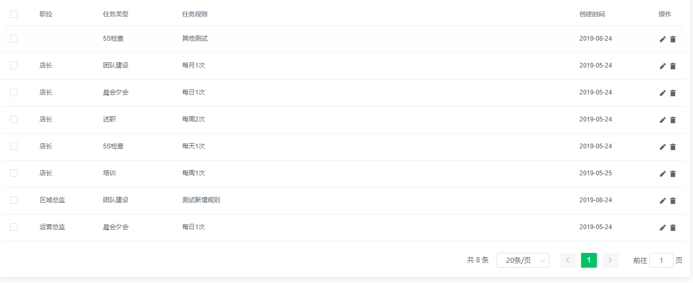
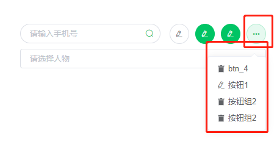
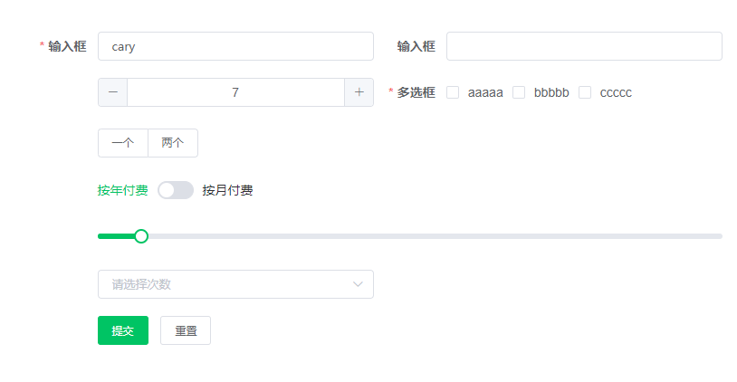

# 组件说明


### 组件列表

- [VueAudio](#VueAudio)
- [CSuperTable](#CSuperTable)
- [c-tiele](#c-tiele)
- [CPhotoPreview](#CPhotoPreview)
- [CSuperTool](#CSuperTool)
- [CSuperQuery](#CSuperQuery)
- [CSuperForm](#CSuperForm)
- [v-permission](#添加指令权限)


## VueAudio

```html

<VueAudio url="https://test.com/test.mp3"></VueAudio>

```

### 属性
| 参数      | 说明          | 类型      | 可选值                           | 默认值  |
|---------- |-------------- |---------- |--------------------------------  |-------- |
| src | 音频地址 | 'String' | — | — |


## CSuperTable 

> 数据表格分页组件

 示例图


```javascript

let option = {}

// 继承之 Table Attributes
option.tableOption: {
  stripe: false,
  isCancel: false // 初始化是否执行网络请求
}

option.tableHeader: [
  {
    type: 'index',
    label: '#',
    prop: 'date',
    width: '60',
    sortable: false,
    align: 'left',
    callback: Funtion
  }
]

// 表格最后一列数据操控

// 1.参控按钮优先显示 icon 属性 其次显示 text 属性，
//   简单的说就是需要需要显示 text 属性请不要设置 icon 属性
// 2.type属性是根据 el-button 的 type 属性 
//   特殊属性: 
//   type设置了 image 属性表格中会呈现出图片的图标,
//   点击事件回调组件的 clickImage 事件 
// 3.需要操作控制的时候,不要传入prop值切记
{
  label: '操作', 
  width: '120',
  control: {
    delete: {
      type: 'text',
      text: '删除',
      icon: 'lajitong'
    },
    check: {
      type: 'text',
      icon: 'chakan',
      text: '查看'
    },
    edit: {
      type: 'text',
      icon: 'ai-edit',
      text: '编辑'
    }
  },
},

// 分页属性
option.pagination: {
  small: false,
  background: false,
  pageCount: 0,
  pagerCount: 7,
  layout: 'total, sizes, prev, pager, next, jumper',
  pageSizes: [20, 30, 50, 100],
  prevText: '',
  nextText: '',
  disabled: false,
  hideSinglePage: false,
  isRefreshButton: false // 是否显示刷新按钮
}

// 导出数据头

option.exportHeader: [
  {
    label: '#',
    prop: 'date'
  },
  {
    label: '名字',
    prop: 'name'
  },
]

```
> 多级表头使用实例
```html

<el-table-column
  slot="beirichengjiao"
  label="本日成交单量"
  width="150">
  <el-table-column prop="status" label="三方" width="35"/>
  <el-table-column prop="status" label="代办" width="35"/>
  <el-table-column prop="status" label="租赁" width="35"/>
  <el-table-column prop="status" label="新房" width="35"/>
  <el-table-column prop="status" label="总计" width="35"/>
</el-table-column>
```
> 多级表头使用实例

```JavaScript
// 导出多级数据表头
let headobj = {
  // 二维数组可以添加多个表头
  multiHeader: [['序号', '区域', '区经姓名', '店组数量', '区域人数', '带看组数', '', '', '本日成交单量', '', '', '', '', '本日成交单量', '', '', '', '', '本月成交单量', '', '', '', '', '本月新增业务', '', '', '', '']],
  header: ['', '', '', '', '', '求购带看', '求组带看', '总计', '三方', '代办', '租赁', '新房', '总计', '三方', '代办', '租赁', '新房', '总计', '三方', '代办', '租赁', '新房', '总计', '三方', '代办', '租赁', '新房', '总计'],
  filter: ['kname', 'ulevel', 'status', 'entertype', 'status', 'status', 'status', 'status', 'status', 'status', 'status', 'status', 'status', 'status', 'status', 'status', 'status', 'status', 'status', 'status', 'status', 'status', 'status', 'status', 'status', 'status', 'status'],
  merges: ['A1:A2', 'B1:B2', 'C1:C2', 'D1:D2', 'E1:E2', 'F1:H1', 'I1:M1', 'N1:R1', 'S1:W1', 'X1:AB1']
} 
this.$refs.myTable.setMultipeHeader(headobj)
this.$refs.myTable.exprotMultipe()

```


### 属性
| 参数      | 说明          | 类型      | 可选值                           | 默认值  |
|---------- |-------------- |---------- |--------------------------------  |-------- |
| tableInterface | 必须要传入的 | Promise | — | — |
| options | 表格中的所有的设置都在这里面 | object | — | object |
| list | 表格本地数据(使用list传入的接口数据将失效) | array | — | [] |


### 表头属性 type
| 参数      | 说明          | 类型    | 默认值  |
|--------- |-------------- |------- |-------- |
| index | 显示表格的序号 | string | — |
| selection | 显示多选框 | string | — |
| image | 在表格中显示图片的图标可打开图片查看器 | string | — |
| link | 在表格文字现在连接,可传入一个 Callback属性, 类型function | string | — |
| tooltip | 鼠标移动到单元格中提示信息 | string | — |
| filter | 自定义属性 | string | — |
| audio | 表格中播放音频 | string | — |
| html | 自定义html代码 | string | — |
| slot | 自定义插槽 | string | — |


### 表头特殊属性 type
| 参数      | 说明          | 类型    | 默认值  |
|--------- |-------------- |------- |-------- |
| 通用属性 | — | — | — |
| width | 列的宽度 | string | — |
| label | 表格头的文字 | string | — |
| prop | 对应的数字字段 | string | — |
| sortable | 可现实排序按钮 | string | — |
| index | — | — | — |
| — | — | — | — |
| selection | — | — | — |
| — | — | — | — |
| image | — | — | — |
| — | — | — | — |
| link | — | — | — |
| buttons | 文本按钮组, 不传此字段的话, 就是一个 | — | — |
| color | 显示的颜色 | primary / success / warning / danger / info | default |
| underline | 是否下划线 | boolean | true |
| disabled | 是否禁用状态 | boolean | false |
| icon | 图标类名,只支持element中的 | string | — |
| callback | 点击链接回调方法 | function回调参数[index, row] | — |
| — | — | — | — |
| tooltip | — | — | — |
| — | — | — | — |
| tipValue | 提示框中显示的的字段名 | — | — |
| — | — | — | — |
| filter | 自定义属性 | string | — |
| — | — | — | — |
| callback | 处理单个参数,接受参数[row] | Funtion | — |
| — | — | — | — |
| audio | 表格中播放音频 | string | — |
| — | — | — | — |
| callback | 处理音频参数,接受参数[row] | Funtion | — |
| — | — | — | — |
| html | 自定义html代码 | string | — |
| — | — | — | — |
| callback | 自定义html代码,接受参数[row] | Funtion | — |
| — | — | — | — |


### 事件
| 事件名称 | 说明 | 回调参数 |
|---------- |-------- |---------- |
| check | 点击 操作中的查看按钮时触发 | index, row |
| edit |  点击 操作中的编辑按钮 | index, row |
| delete |  点击 操作中的删除按钮 | index, row |
| selection |  表格中选择多条数据返回数组 | [row] |
| clickImage |  表格中点击图片图标 | index, row |
| current-change |  表格中选中项回调 | row, cloumn |
| interface |  数据加载完成时回调 | row, cloumn |
| expand-change |  表格左侧有多级的点击事件(参数继承与el-table) | any |
- - -

### CSuperTable slot
| name | 说明 |
|---------- |-------- |
| tableHeader | 插入表格最前面的头自定义元素 |


### 对象公共方法
| 事件名称 | 说明 | 参数 |
|---------- |-------- |---------- |
| updateList | 更新数据使用 | 请求参数,用于条件查询 |
| getSelectionList |  选择表格数据的列表 | — |
| exportData |  导出数据直接导出Excel | — |
| exprotMultipe |  导出多数据pageSize:9999999 | — |
| setMultipeHeader |  设置多级表头的属性 先设置在导出 | { multiHeader, header, filter, merges } |
| exprotMultipeHeader |  设置多级表头的属性 先设置在导出 | — |
| showImage |  显示图片需要传入图片的url | url |
| addHeader |  添加数据表头 | object |
| setFilterData |  网络请求数据过滤 | function |
| exprotMultipeExcel |  导出合计多级表头数据, 方法只是把 id 最后一个 序号改成 '合计' | list, issum |

## CPhotoPreview

图片查看器,全局组件

```html
  <CPhotoPreview v-model="imagePreviewVisible" :imgs="imagePreviewValue"/>
```


### 属性
| 参数      | 说明          | 类型      | 可选值                           | 默认值  |
|---------- |-------------- |---------- |--------------------------------  |-------- |
| v-model | 必须要传入的用于显示和隐藏弹出框 | Boolean | — | false |
| imgs | 图片的url | String/Array | — | '' |


## CSuperTool

超强搜索按钮组集合组件



* 使用实例

```html

<c-super-tool ref="supertool" :options="btnOptions">
  <super-test slot="superTest"/>
  <super-test slot="superTesta"/>
</c-super-tool>

```

```javascript

btnOptions: {
  btns: [
    {
      name: 'btn_1',                // 按钮的名字, 没有特别大的意义,用于区分key,
      type: '',                     // 继承element-ui中 el-button type
      tip: '平常按钮',               // 按钮鼠标移上出现的提示的文字
      icon: null,                   // 使用 iconfont-阿里巴巴图标可以传入图标名称
      eicon: 'el-icon-edit',        // 使用 element-ui 中的图标,icon和eicon都有的情况,优先使用这个.
      callback: () => {},           // 按钮点击事件 
      component: 'superTest',       // 点击按钮出现, 自定义弹出框
      delete: { title: '是否删除!' } // 点击按钮出现, 选择提示框 
    },
    
  ]
}

```


### 属性
| 参数      | 说明          | 类型      | 可选值                           | 默认值  |
|---------- |-------------- |---------- |--------------------------------  |-------- |
| options | 超强按钮组中的所有的设置都在这里面 | object | — | object |
- - -


### 属性 options.btns
| 参数      | 说明          | 类型      | 可选值                           | 默认值  |
|---------- |-------------- |---------- |--------------------------------  |-------- |
| name | 按钮的名字, 没有特别大的意义,用于区分key | string | — | super_btns_index |
| type | 继承element-ui中 el-button type | string | primary / success / warning / danger / info / text | super_btns_index |
| tip | 按钮鼠标移上出现的提示的文字 | string | — | — |
| icon | 使用 iconfont-阿里巴巴图标可以传入图标名称 | string | — | — |
| eicon | 使用 element-ui 中的图标,icon和eicon都有的情况,优先使用这个 | string | — | — |
| callback | 按钮点击事件 | function | — | — |
| component | 点击按钮出现, 自定义弹出框,必须要和slot中的name一样,并且不能重复 | string | — | — |
| delete | 点击按钮出现, 选择提示框 | object | — | — |
- - -

### 事件
| 事件名称 | 说明 | 回调参数 |
|---------- |-------- |---------- |
| input-search | 点击搜索触发 | value |
- - -

### 对象公共方法
| 方法名称 | 说明 | 参数 |
|---------- |-------- |---------- |
| setBtnActive | 更新按钮状态, 只支持显示出来的按钮, 隐藏的按钮不可以 | [btn, boolean] |

- - -


## CSuperQuery

超强创建form元素


### CSuperQuery type
| 参数      | 说明          | 类型    | 默认值  |
|--------- |-------------- |------- |-------- |
| radio | 单选组件 | string | — |
| radio-button | 单选按钮组 | string | — |
| checkbox | 多选组件 | string | — |
| checkbox-button | 多选的按钮组 | string | — |
| input | 输入框 | string | — |
| input-number | 数字输入框 | string | — |
| datepicker | 时间选择器 | string | — |
| select-page | 带有分页的选择器 | string | — |
| cascader | 多级联动 | string | — |
| cascader-single | 多级联动-单击选中 | string | — |
| empty | 空行主要用于, 两行的情况最后一个在最右测问题 | string | — |
| slot | 可以放入自定义的组件 | string | — |

- - -


### 对象公共方法
| 方法名称 | 说明 | 参数 | 返回值 |
|---------- |-------- |---------- |---------- |
| setFormValue | 设置某个表单value | [name, val] | -- |
| setFormEdit | 设置某个表单字段属性 | [name, val] | -- |
| getValueObj | 获取所有的参数 | Object | object |
| getFormList | 获取所有列表 | -- | Array |
| getFormObj | 获取指定的某项列表 | [key, value] | Array |
| resetValue | 重置所有参数为空 | Object | -- |


- - -


## CSelectPage

select组件添加了数据表格分页效果
表格组件完全基于 CSuperTable

### props
| 参数      | 说明          | 类型    | 默认值  |
|--------- |-------------- |------- |-------- |
| value | vue中的 v-model | string | — |
| option | 组件属性 | object | — |
| tableInterface | 数据接口 | function | — |
| tableHeader | 表格表头, | array | — |

- - -

### option 属性
| 参数      | 说明          | 类型    | 默认值  |
|--------- |-------------- |------- |-------- |
| placeholder | 输入框中未输入的文字 | string | — |
| idField | 需要返回的字段属性 | string | — |
| label | 选中数据表格中的字段名字 | string | — |
| filterName | 可搜索的字段 | string | — |
| filterable | 是否可以搜索 | string | — |
| callback | 选中行的回调 | string | [row, cloumn] |


- - -

``` javascript
option: {
  placeholder: '请选择',
  idField: '',
  label: ''
  filterName: '',
  filterable: '',
  callback: () => {}
},

```

## CSuperForm

超强创建form表单提交

示例图:


使用示例:

```html

<c-super-form :options="optionForm"/>

```

```javascript

// options

optionForm: {
  labelWidth: '80px',
  value: {
    name: 'cary',
    age: '2123',
    chenacheckbox: []
  },
  rules: {
    name: [
      { required: true, message: '请输入活动名称', trigger: 'blur' }
    ],
    age: [
      { required: true, message: '请输入年龄', trigger: 'blur' }
    ],
    chenacheckbox: [
      { required: true, message: '请输入年龄' }
    ],
  },
  forms: [
    {
      id: 'a1',
      type: 'input',
      prop: 'name',
      itemLabel: '输入框'
    },
    {
      id: 'a2',
      type: 'input',
      prop: 'age',
      itemLabel: '输入框'
    },
    {
      id: 'a3',
      type: 'input',
      prop: 'chenagshi',
      itemLabel: '输入框'
    },
    {
      id: 'a4',
      type: 'checkbox',
      prop: 'chenacheckbox',
      itemLabel: '多选框',
      list: [
        {
          label: 'fdfd',
          text: 'aaaaa'
        },
        {
          label: 'fdfb',
          text: 'bbbbb'
        },
        {
          label: 'fdfe',
          text: 'ccccc'
        },
      ]
    },
    
  ]
}

```

### props
| 参数      | 说明          | 类型    | 默认值  |
|--------- |-------------- |------- |-------- |
| option | 表单组件属性 | object | — |


### option 属性
| 参数      | 说明          | 类型    | 默认值  |
|--------- |-------------- |------- |-------- |
| action | 表单提交的地址 | Promise | -- |
| labelWidth | 基于form的labelwidth | string | -- |
| ref | 表单元素的ref的值 | string | 'c_super_form' + this._uid |
| value | 表单字段数据(绑定v-model的数据) | object | {} |
| rules | 字段验证规则 [async-validator](https://github.com/yiminghe/async-validator) | object | — |
| Forms | 需要创建的表单中的内容 | array | — |
| submitLoading | 提交按钮变成加载状态 | boolean | false |
| submitLoadingText | 提交按钮变成加载状态文字 | string | '请求中...' |
| isShowSubmit | 表单是否要显示下面提交按钮 | boolean | true |
| beforeSubmit | 提交表单前置方法, 可拦截提交表单 | function | boolean |
| onValidateError | 提交表单验证失败的时候回调 | function | -- |
| actionCallback | 接口回调方法 | function | boolean |
| submitText | 表单提交的按钮文字 | string | 提交 |
| resetText | 表单重置的按钮文字 | string | 重置 |


### forms 属性
| 参数      | 说明          | 类型    | 默认值  |
|--------- |-------------- |------- |-------- |
| type | 组件类型 | string | — |
| hidden | 是否需要显示组件 | boolean | — |
| itemLabel | el-form-item 中显示的label | string | — |
| prop | 验证规则字段 | string | — |
| callback | 可选, 组件中有change事件的可传入回调 | string | — |


### type 属性
| 参数      | 说明          | 类型    | 默认值  |
|--------- |-------------- |------- |-------- |
| radio | 单选框可以可以传入 list 变单选框组 | string | — |
| radio-button | 单选框可以可以传入 list 变单选框组 | string | — |
| checkbox | 复选框可以可以传入 list 变复选框组 | string | — |
| checkbox-button | 复选框可以可以传入 list 变复选框组 | string | — |
| input | 普通输入框 | string | — |
| input-number | 数字输入框 | string | — |
| select | 下拉选择框 | string | — |
| cascader | element-ui 连级选择器 | string | — |
| cascader-single | 自定义可单选项连级选择器 | string | — |
| switch | 开关组件 | string | — |
| timepicker | 时间选择组件 | string | — |
| datepicker | 日期选择组件 | string | — |
| slot | 可自定表单中任何组件 | string | — |


### CSuperForm 公共方法

| 方法名称   | 说明 | 参数 | 返回值 |
|---------- |-------- |---------- |---------- |
| setValue | 设置value属性的值 | key, val | --- |
| getValue | 获取value属性的值 | -- | object |
| setSubmitText | 设置提交按钮的文字 | text | --- |
| setSubmitLoading | 设置提交按钮变成加载状态 | true/false | --- |


## End
